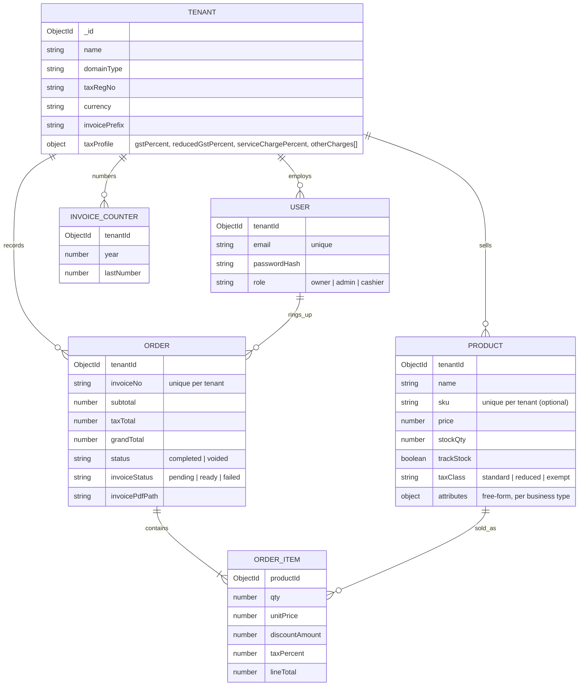

# Data model (MongoDB)

```mermaid
erDiagram
  TENANT ||--o{ USER : employs
  TENANT ||--o{ PRODUCT : sells
  TENANT ||--o{ ORDER : records
  TENANT ||--o{ INVOICE_COUNTER : numbers
  USER ||--o{ ORDER : rings_up
  ORDER ||--|{ ORDER_ITEM : contains
  PRODUCT ||--o{ ORDER_ITEM : sold_as

  TENANT {
    ObjectId _id
    string name
    string domainType
    string taxRegNo
    string currency
    string invoicePrefix
    object taxProfile "gstPercent, reducedGstPercent, serviceChargePercent, otherCharges[]"
  }
  USER {
    ObjectId tenantId
    string email "unique"
    string passwordHash
    string role "owner | admin | cashier"
  }
  PRODUCT {
    ObjectId tenantId
    string name
    string sku "unique per tenant (optional)"
    number price
    number stockQty
    boolean trackStock
    string taxClass "standard | reduced | exempt"
    object attributes "free-form, per business type"
  }
  ORDER {
    ObjectId tenantId
    string invoiceNo "unique per tenant"
    number subtotal
    number taxTotal
    number grandTotal
    string status "completed | voided"
    string invoiceStatus "pending | ready | failed"
    string invoicePdfPath
  }
  ORDER_ITEM {
    ObjectId productId
    number qty
    number unitPrice
    number discountAmount
    number taxPercent
    number lineTotal
  }
  INVOICE_COUNTER {
    ObjectId tenantId
    number year
    number lastNumber
  }
```

Every document carries `tenantId`, and every service query filters on it. That is what keeps one business's data invisible to another.
